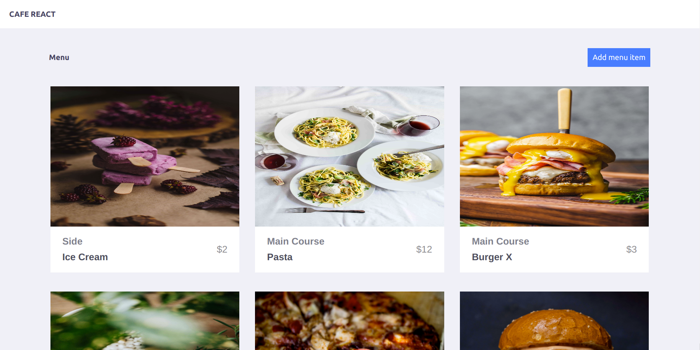
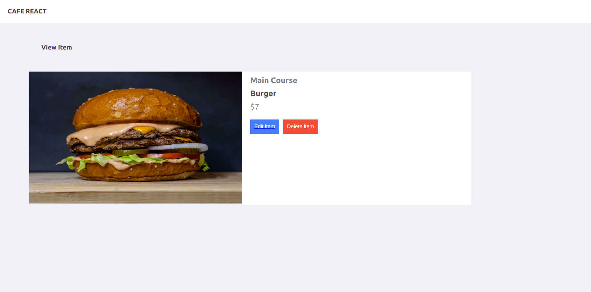
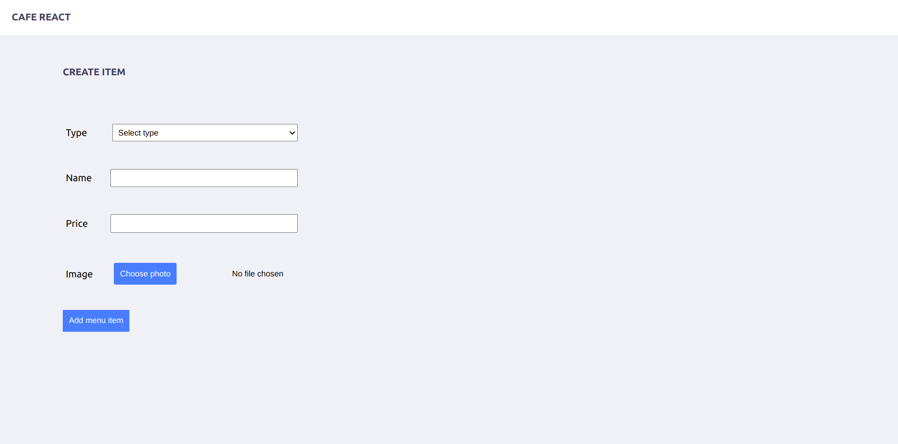

### This project is a single page application built with react and redux 

#### The application is a cafe menu it uses [this rails API](https://github.com/Tresor11/cafe-react-api/) to get the data.

> The `/` route is a list of the available items from which you can select a specific items to see more details.

> The `/items/id` route shows the item details with two buttons for edit and delete.

> the `/newitem` and `/items/id/edit` routes shows respectively a form form creating an item and form editing an item.

## Built With

- javaScript
- React
- Rails
- Redux
- Node js
- Netlify

## Live Demo

[Live Demo Link](https://cafe-react.netlify.app/)

## Getting Started

Here are the steps to follow in order to get this project on your local computer.

### Prerequisites

`node v12.16.3 +`

`npm v6.14.4 +`

### Setup

clone this repo by typing `git clone https://github.com/Tresor11/cafe-react.git`

### Install

install the dependacies by typing `npm install`

### Usage

start the local server by running `npm start`

### Deployment

this project is deployed on netlify

to get the deployment build of the code run `npm run build`

### Testing

this project uses jest from testing , to run the tests type `npm test` 

## Authors

👤 **Tresor bireke**

- Github: [@Tresor11](https://github.com/Tresor11)
- Twitter: [@Tbireke](https://twitter.com/Tbireke)

## 🤝 Contributing

Contributions, issues and feature requests are welcome!

Feel free to check the [issues page](issues/).

## Show your support

Give a ⭐️ if you like this project!

## Acknowledgments

- Hat tip to anyone whose code was used
- Inspiration
- etc

## 📝 License

This project is [MIT](lic.url) licensed.

